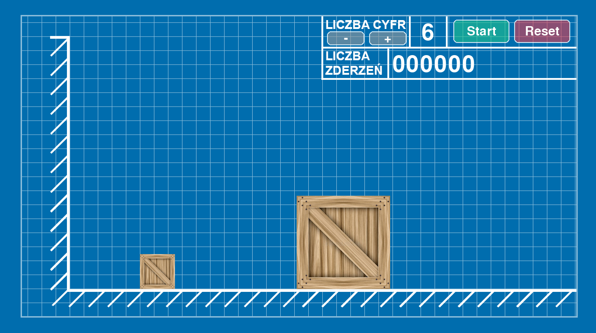
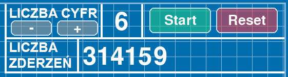

# Projekt zaliczeniowy WFIT 2025L <br /> Szymon Prusaczyk, Ignacy Kopka


## Aproksymacja liczby π poprzez zderzające się bloki

Program napisany przez nas jest symulacją zderzeń dwóch ciał, oraz ściany.<br />

Symuluje on opisane
przez Gregorego Galperina zjawisko w pracy naukowej **_PLAYING POOL WITH π
(THE NUMBER π FROM
A BILLIARD POINT OF VIEW)_**. <br />

Praca opisuje sytuację, w której dwa ciała, z których jedno ma masę dowonlej potęgi stukrotności masy drugiego,
odbijają się idealnie sprężyście oraz bez tarcia od siebie i od ściany. W takiej sytuacji liczba ich odbić będzie
przedstawiała kolejne cyfry liczby π.


## Opis Działania Symulacji

Symulacja jest napisana w pythonie z użyciem biblioteki pygame do wizualizacji oraz obsługi dźwięku.


### Wzory fizyczne
Jako, iż symulujemy zderzenia idealnie sprężyste to całkowity pęd oraz energia kinetyczna układu pozostają stałe.

W takiej sytuacji dla dwóch ciał o masach \($m_1$\) i \($m_2$\) oraz prędkościach początkowych \($v_1$\) i \($v_2$\), prędkości po zderzeniu oznaczone jako \($v_1'$\) i \($v_2'$\) wyrażają się wzorami:

$$
v_1' = \frac{(m_1 - m_2)\,v_1 + 2\,m_2\,v_2}{m_1 + m_2},
$$

$$
v_2' = \frac{(m_2 - m_1)\,v_2 + 2\,m_1\,v_1}{m_1 + m_2}.
$$

Powyższe wzory zostały w kodzie zapisane w następujący sposób. <br />
Ten fragment opisuje metodę obliczającą nową prędkość ciała po zderzeniu:
```python
def bounce(self, other):
    total_mass = self.m + other.m
    new_v = ((self.m - other.m) * self.v + 2 * other.m * other.v) / total_mass
    return new_v
```
W tym miejsciu program używa metody _bounce_ obliczającej prędkość po wykryciu kolizji między blokami:
```python
if self.block1.collide(self.block2):
    v1 = self.block1.bounce(self.block2)
    v2 = self.block2.bounce(self.block1)
    self.block1.v = v1
    self.block2.v = v2
    clack_happened = True
    self.count += 1

```

Podczas kolizji ze ścianą prędkość zmienia się w następujący sposób:

$$
v'=-v
$$

Jest to reprezentowane w kodzie poprzez:
```python
if self.block1.x <= self.wall_x:
    self.block1.x = self.wall_x
    self.block1.vel *= -1
    self.collisions += 1
```
gdzie zmieniamy zwrot wektora prędkości bloku podczas wykrycia zderzenia ze ścianą.


### Działanie w formie cyfrowej

Komputer nie jest w stanie symulować ciągłego przedziału czasu i zasymulować 1:1 świata rzeczywistego,
z tego powodu jesteśmy zmuszeni zdyskretyzować czas w symulacji.

#### Dyskretyzacja czasu a masa obiektów
Liczba kroków wykonywanych przez program w czasie sekundy zależy od stosunku mas obu obiektów a co za tym idzie
liczby cyfr π jaką chcemy wyznaczyć.

Aby liczba odbić mniejszego bloku o masie od ściany i drugiego bloku była kolejnymi cyframi liczby pi, to masa
cięższego obiektu  $m_2$ musi być równa potędze stukrotności masy  $m_1$ mniejszego bloku i wyznaczona jest wzorem:
$$
m_2 = (m_1 * 100)^{n-1}
$$
```python
mass = 100 ** (digits - 1)
```
 gdzie $n$ = liczbie kolejnych cyfr liczby π, którą chcemy wyznaczyć.

Z powodu tak dużej różnicy mas i liczby zderzeń bloków musimy wraz ze wzrostem masy bloku ciężkiego zwiększać także
liczbę kroków czasowych, ponieważ w pewnym momencie zaczęłyby one przez siebie po prostu przenikać i nie doszłoby do
detekcji kolizji.

```python
self.time_steps = 10 ** (digits - 1)
```
Definiując liczbę kroków w taki sposób dla znajdywania:
* 1 cyfry - 1 krok
* 2 cyfr - 10 kroków
* 3 cyfr - 100 kroków
* 6 cyfr - 100 000 kroków
* itd.

Program działa z prędkością maksymalnie 60 klatek na sekundę, więc dla 6 cyfr w ciągu sekundy wykonujemy 6 000 000 kroków
na sekundę.

Jest to bardzo nieoptymalny sposób wyznaczania liczyb π, ilość kroków potrzebnych do obliczń rośnie na tyle szybko, że już dla 7 cyfr program zaczyna działać bardzo wolno,
a powyżej 7 cyfr przestaje działać całkowicie.


### Co się dzieje w każdym kroku czasowym?

W każdym kroku czasowym odbywają się 3 kluczowe czynności:

1. Sprawdzanie kolizji między blokami:

```python
if self.block1.collide(self.block2):
```


2. Jeśli doszło do zderzenia, obliczane są nowe prędkości bloków zgodnie ze wzorem sprężystego zderzenia:

```python
v1 = self.block1.bounce(self.block2)
v2 = self.block2.bounce(self.block1)
self.block1.v = v1
self.block2.v = v2
```


3. Aktualizacja pozycji bloków na podstawie ich prędkości:

    
```python
self.block1.update()
self.block2.update()
```


### Zliczanie zderzeń

Zderzenia są zliczane w dwóch sytuacjach:

1. Gdy lekki blok zderza się z ciężkim blokiem:

```python
if self.block1.collide(self.block2):
    v1 = self.block1.bounce(self.block2)
    v2 = self.block2.bounce(self.block1)
    self.block1.v = v1
    self.block2.v = v2
    self.collisions += 1
```

2. Gdy lekki blok uderza w ścianę:

```python
if self.block1.x <= self.wall_x:
    self.block1.x = self.wall_x
    self.block1.vel *= -1
    self.collisions += 1
```

W obu przypadkach licznik `self.collisions` zwiększa się o 1.
Na koniec liczba zderzeń odpowiada kolejnym cyfrom liczby π.


## Działanie Symulacji

Poniżej zamieszczony jest .gif przedstawiający działanie symulacji oraz link do filmu na youtube.


[Wideo w serwisie YouTube](https://youtu.be/gTFYmqfvw9Y)

#### Dla wyznaczenia 6 cyfr liczby wynikiem jest 314159.



π = **3,14159**2653589... jesteśmy, więc w stanie stwierdzić, że symulacja wyznacza cyfry liczby pi w poprawny sposób.

Podobnie sprawdza się to również dla każdej liczby cyfr poniżej 6. Nie udało się nam niestety uzyskać wyniku dla 7 cyfr liczby π.


## Reszta kodu

Pozostała część kodu odpowiada głównie za wygląd aplikacji oraz obsługę graficznego interfejsu użytkownika (GUI).

* **Klasa _Block_** — reprezentuje pojedynczy blok. Przechowuje informacje o jego masie, pozycji, prędkości i rozmiarze. Zawiera metody do aktualizacji pozycji (_update_), sprawdzania kolizji (_collide_) oraz obliczania nowej prędkości po zderzeniu (_bounce_).

* **Klasa _Simulation_** — odpowiada za logikę fizyczną całego układu. Wykonuje obliczenia związane z ruchem i kolizjami, zlicza zderzenia oraz zarządza krokami czasowymi.

* **Moduł główny (_main_)** — odpowiada za uruchomienie programu, stworzenie okna graficznego, inicjalizację obiektów, kontrolę liczby kroków czasowych oraz obsługę głównej pętli programu.

* **Pygame** — używany jest do:

  * rysowania prostokątów reprezentujących bloki,
  * wyświetlania liczby zderzeń w czasie rzeczywistym,
  * odświeżania ekranu w ustalonym tempie (do 60 klatek/s),
  * odtwarzania dźwięków kolizji,
  * reagowania na zdarzenia systemowe (np. zamknięcie okna).


